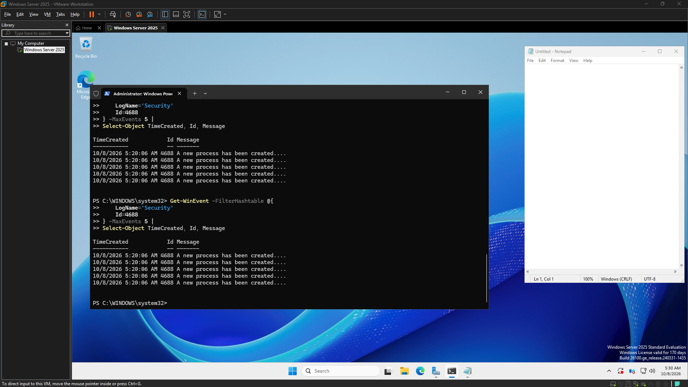

# CyberOps Sandbox

Status: Current focus: telemetry visibility gaps and operational logging validation

## Project story
The latest phase of CyberOps Sandbox is focused on understanding what the environment can actually observe and what remains hidden. The key objective is to validate telemetry behavior in a controlled Windows environment so that future detection and response work is grounded in real evidence rather than assumptions.

## What matters most right now
- We are validating how much activity is visible in Windows security telemetry.
- The latest work identified a real visibility gap in process and file activity tracking.
- The project is moving toward better audit policy understanding and stronger operational logging for future detection workflows.

## Key proof moments
### Highlight: Telemetry visibility gap

### Highlight: Process creation telemetry review

### Highlight: Security event distribution review

## Lessons learned
- Negative results are still valuable evidence.
- A system can be active without being meaningfully visible in the telemetry.
- Audit policy understanding matters before you trust the logs.
- Good labs are built by testing the environment and documenting what it actually sees.

## Next steps
- Investigate the required audit policy changes on NS-DC01.
- Re-run controlled tests to validate improved process and file telemetry visibility.
- Capture clean evidence for the new baseline once the environment is fixed.
- Keep the README and status file aligned with the operational story as the lab matures.
