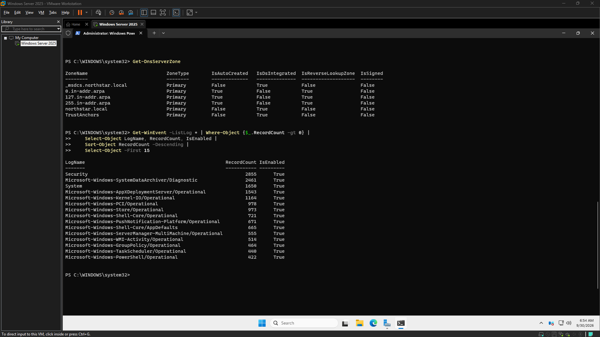

# Engineering Log – 2026-09-30

## Screenshot – CyberOps Baseline v0.1

---

## Session – 06:46 to 06:55
### Goal
Baseline the Existing Northstar Environment

### Definition of Done
all information, specs and working information is gathered

### Goal Achieved
✅ Yes

Summary:
Initial project baselining activities have been completed, with key specifications documented.

Tasks Completed:
* Noted baseline specifications for the project.

Issues Encountered:
No issues or significant struggles were encountered during this period.

Next Steps:
Next steps are not detailed in the current notes. Further planning will be required to define upcoming tasks.

Notes:
No additional notes were provided for this update.

### Working Story
None

### Friction and AI Gaps
None

### What the AI Missed
None

### AI Peer Review
Status: Approved
Reviewer: human
Reviewed At: 2026-09-30 06:58:14
Reviewer Notes: Host OS: Windows 11 Home, build 26200

### Duration
9 minutes (Planned: 180 minutes)

### Notes
Gaming PC: your primary Windows host for the Help Desk Lab / future homelab
