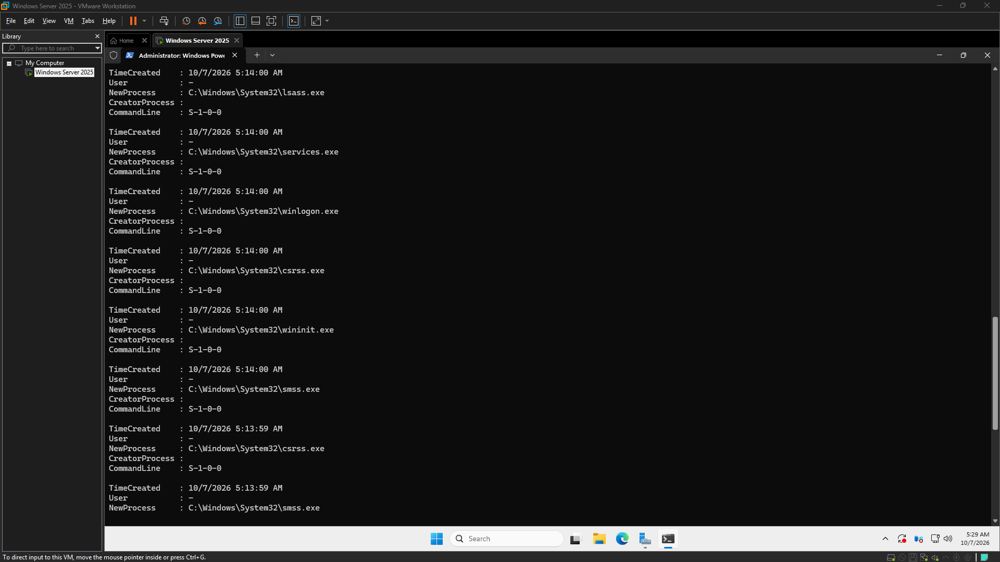
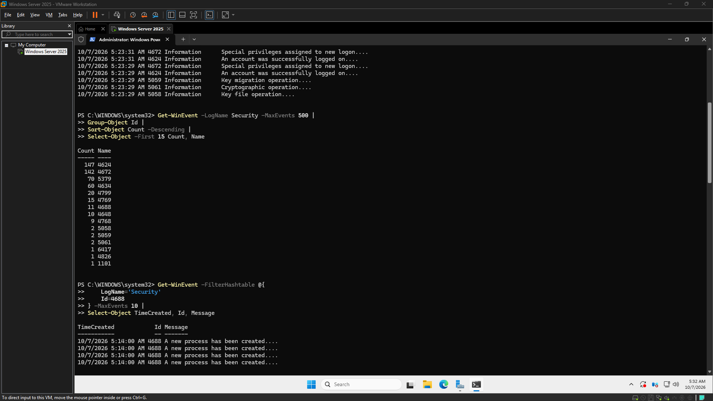

# Engineering Log – 2026-10-07

---

## Session – 05:12 to 05:17
### Goal
Establish the documentation foundation for the existing Northstar environment.

### Definition of Done
Document the existing state of NS-DC01, Windows Server, Active Directory, DNS, Network foundation, Current virtualization environment

### Goal Achieved
❌ No

Summary:
The previous work session has been deemed unsatisfactory and requires a complete re-execution. No tasks from this session can be considered successfully completed at this time.

Tasks Completed:
None

Issues Encountered:
The recently completed work session requires a full redo due to unsatisfactory outcomes.

Next Steps:
Re-execute the entire session to achieve the desired results.

Notes:
*   No specific struggles were encountered during the initial attempt, despite the need for re-work.
*   No discrepancies or errors related to AI tools were identified.
*   No particular emphasis or narrative is required for this update.

### Working Story
None

### Friction and AI Gaps
None

### What the AI Missed
None

### AI Peer Review
Status: Approved
Reviewer: human
Reviewed At: 2026-10-07 05:18:06
Reviewer Notes: 

### Duration
4 minutes (Planned: 20 minutes)

### Notes

## Screenshot – Process Creation Telemetry

## Screenshot – Security Event Distribution

---

## Session – 05:22 to 05:37
### Goal
Establish what security telemetry Northstar already has

### Definition of Done
NS-DC01 is confirmed operational., Existing DNS/event-log baseline is acknowledged rather than recreated., Windows Security Event Log is inspected., Recent security events are identified., At least one useful event type is recognized for future investigation.

### Goal Achieved
✅ Yes

Summary:
The current phase of the CyberOps Sandbox development focused on incrementally building security operational capabilities from existing Windows infrastructure, specifically NS-DC01. This involved establishing the available security telemetry and confirming that Windows Security Event Logs are a queryable data source for investigations, aligning with a hands-on learning approach rather than deploying a pre-configured SOC solution.

Tasks Completed:
*   Identified existing security telemetry on NS-DC01.
*   Confirmed that Windows Security Event Logs can be queried as an investigation data source.

Issues Encountered:
*   Initial lack of clarity regarding the practical definition of "telemetry."
*   Misconception that an additional infrastructure baseline was required, despite previous baselining.
*   Ongoing learning challenges related to understanding Windows Event IDs and their provided information.
*   Difficulty experienced in extracting useful fields from Event ID 4688.

Next Steps:
(No specific next steps were provided in the rough notes.)

Notes:
The overarching strategy for the CyberOps Sandbox is to build it incrementally from an existing Windows infrastructure foundation. This approach is designed to foster learning security operations through direct investigation of the environment, contrasting with the installation of a prebuilt SOC stack.
AI did not miss or misinterpret any information provided.

### Working Story
Built the CyberOps Sandbox incrementally from an existing Windows infrastructure foundation, learning security operations by directly investigating the environment rather than installing a prebuilt SOC stack.

### Friction and AI Gaps
Initially unclear what "telemetry" meant in practical terms, the session initially appeared to require another infrastructure baseline even though the environment had already been baselined previously, understanding Windows Event IDs and what information they provide is still new, extracting useful fields from Event ID 4688 was less straightforward than expected.

### What the AI Missed
None

### AI Peer Review
Status: Approved
Reviewer: human
Reviewed At: 2026-10-07 05:38:34
Reviewer Notes: 

### Duration
14 minutes (Planned: 10 minutes)

### Notes

